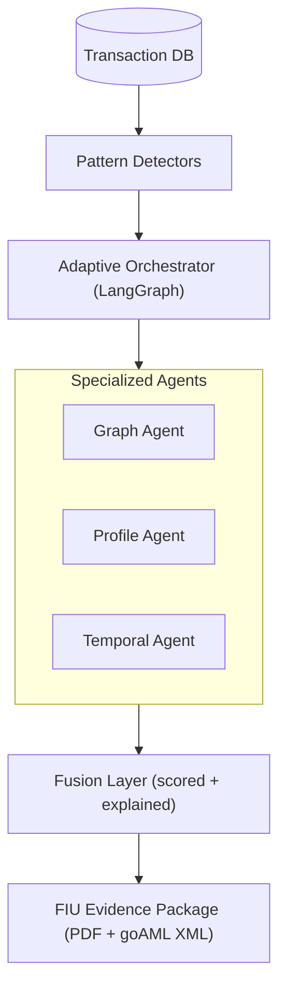

# FundDrishti 🔍
**AI-Powered Fund Flow Intelligence for Fraud Detection**  
*iDEA 2.0 Hackathon · Union Bank of India · PS3*

---

## The Problem

Enterprise AML systems generate thousands of alerts daily with a 95–99% false positive rate.  
When a real alert fires, investigators spend **3–7 days** manually logging into 8 systems, building transaction graphs by hand, and writing FIU narratives from scratch.  
**The bottleneck is not detection — it is that detected signals never become actionable intelligence efficiently.**

---

## Our Solution

FundDrishti is an **agentic investigation system** that takes a suspicious alert and produces a complete, investigator-ready case file in under 3 minutes.

We are not building another detector. We are the **force multiplier on top of existing detectors** — compressing 3 days of manual investigator work into a reviewed, structured FIU evidence package.

---

## How It Works


**Five fraud patterns detected:**
- Structuring / Smurfing — fan-in below CTR threshold
- Layering — multi-hop BFS with temporal sequence validation
- Round-trip / Circular transactions — DFS cycle detection
- Coordinated dormant activation — temporal subgraph + community detection ← novel contribution
- Profile mismatch — z-score anomaly within declared peer group

**What makes it genuinely different:**
- Orchestrator dynamically scopes agents to the relevant subgraph only — not all agents on all accounts
- Every risk score point traces back to a specific transaction or finding
- Score weights are derived from logistic regression coefficients on 1000 labeled cases — not arbitrary numbers
- Human-in-the-loop by design — investigator reviews and signs before any FIU submission

---

## Tech Stack

| Layer | Technology |
|---|---|
| Graph engine | NetworkX (Python) |
| Agent orchestration | LangGraph |
| ML — scoring weights | scikit-learn · Logistic Regression |
| ML — profile anomaly | Z-score within peer group |
| LLM — narrative | Google Gemini API (free tier) |
| Backend | FastAPI |
| Database | SQLite |
| Frontend | React + Cytoscape.js + Recharts |
| FIU PDF | ReportLab |
| FIU XML | Python standard library |
| Deployment | Render (free tier) |

---

## Project Structure
```text
funddrishti/
├── backend/
│   ├── main.py                  # FastAPI app + all routes
│   ├── database.py              # SQLite schema + connection
│   ├── synthetic/               # Data generator + fraud planters
│   ├── detectors/               # 5 pattern detectors
│   ├── agents/                  # Orchestrator + 3 agents
│   ├── fusion.py                # Scoring logic
│   ├── narrative.py             # Gemini API + template fallback
│   └── fiu_package.py           # PDF + goAML XML
├── frontend/
│   └── src/
│       ├── pages/               # AlertQueue · Investigation · CaseReview
│       └── components/          # GraphView · AgentPanel · Timeline
├── data/                        # SQLite DB (gitignored — regenerate locally)
├── docs/                        # D1 and D3 submission documents
└── README.md
```

---

## Running Locally

**1. Clone and install**
```bash
git clone https://github.com/your-org/funddrishti.git
cd funddrishti/backend
pip install -r requirements.txt
```

**2. Generate synthetic data**
```bash
python synthetic/generator.py
```
This creates `data/funddrishti.db` with 500 accounts, 10,000 transactions, 200 labeled fraud cases across all 5 pattern types, and 10 pre-seeded watchlist accounts.

**3. Start the backend**
```bash
uvicorn main:app --reload
```

**4. Start the frontend**
```bash
cd ../frontend
npm install
npm run dev
```

---

## Evaluation

| Metric | Value |
|---|---|
| Synthetic cases | 1000 (200 fraud · 800 clean) |
| Clean-but-suspicious cases | 300 (NRI remittances, bulk payroll, chit funds, agricultural) |
| Adversarial cases | 100 (near-threshold structuring, delayed layering) |
| Evaluation | Confusion matrix per pattern type — see `/docs` |

---

## Known Limitations

- Graph engine (NetworkX) is in-memory — production path is Neo4j AuraDB
- Database (SQLite) — production path is TimescaleDB
- Narrative generation requires Gemini API key — falls back to structured template if unavailable
- All data is synthetic — real deployment requires integration with core banking transaction feeds
- goAML XML implements STR core fields — full schema extensible per FIU-IND requirements

---

## Team — AlgoGuardians

Built for iDEA 2.0 · PSBs Hackathon Series 2026  
Union Bank of India · K.J. Somaiya School of Engineering