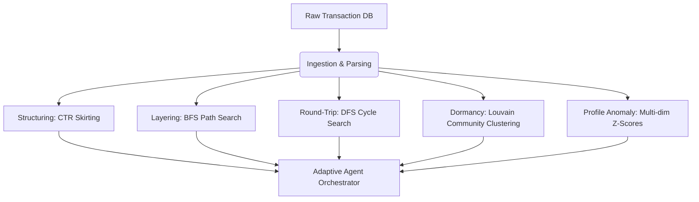

# FundDrishti

**Adaptive Graph-Based Anti-Money Laundering (AML) Investigation Platform**

FundDrishti is a full-stack financial intelligence platform designed to automate the anti-money laundering (AML) investigation lifecycle. It ingests transactional data, identifies suspicious patterns using graph and statistical algorithms, orchestrates specialized analytical agents on localized subgraphs, calculates explainable risk scores using machine learning, and compiles compliance-ready evidence packages.

---

## 💡 The Core Problem & Solution

In modern banking, traditional transaction monitoring systems generate thousands of alerts with a **95–99% false positive rate**. Once an alert is flagged, human investigators must manually query multiple systems, construct transaction graphs, compute risk scores, and write detailed narratives for regulatory filing. This manual process takes **3 to 7 days per case**.

**FundDrishti solves the investigation bottleneck** by performing autonomous end-to-end casework in **under 1 second**. It acts as an automated investigator assistant:
1. **Detects** complex suspicious typologies using specialized network/statistical engines.
2. **Scopes and executes** targeted analytical agents on relevant subgraphs to trace flows.
3. **Fuses findings** into a point-traceable risk score using weights derived from Logistic Regression.
4. **Drafts** compliance-ready Suspicious Transaction Report (STR) narratives using Gemini 1.5 Flash.
5. **Compiles** a final evidence package (an investigator-ready PDF and a regulator-compliant goAML XML).

---

## 📦 Key Deliverables

The platform provides a complete, functional full-stack solution:
* **Interactive Frontend Dashboard**: Built in React with Cytoscape.js. It features a transaction graph visualization with animated sequence replay, chronological transaction timelines, risk score breakdowns, and investigator sign-off controls.
* **FastAPI Backend Services**: Structured REST API providing endpoints for detection runs, multi-agent graph investigations, explainable scoring, case management, and export generation.
* **Point-Traceable PDF Evidence Report**: A professionally formatted ReportLab PDF containing a case summary, mathematical risk score breakdown, transaction ledgers, agent notes, and formal banking sign-off sections.
* **goAML-Compliant XML**: A structured XML file complying with the international goAML standard (comprising `ARFBAT` batch metadata, `ARFRPT` report details, `ARFACC` account details with `ARFINP` individual details, and `ARFTRN` transaction logs) ready for direct filing to Financial Intelligence Units like FIU-IND.

---

## 🛠️ Technology Stack

| Layer | Component | Implementation | Rationale |
|---|---|---|---|
| **Graph Engine** | Network Analysis | **NetworkX** | Provides auditable, mathematical graph operations (in-degree/out-degree hubs, BFS, DFS, cycle detection). |
| **Statistical Anomaly** | Profile Benchmarking | **NumPy** & Custom Vector math | Compares customer behavior against declared peer groups using multi-dimensional Z-score metrics. |
| **Clustering Engine** | Community Detection | **Python-Louvain** | Validates coordinated node reactivation via Modularity Maximization. |
| **Explainable ML** | Risk Score Fusion | **scikit-learn** (Logistic Regression) | Learns coefficient weights from historical investigation cases; avoids "black-box" decisions. |
| **Generative AI** | Narrative Drafts | **Google Gemini 1.5 Flash** | Compiles structured agent findings into professional banking narratives. |
| **Evidence Output** | PDF & XML Export | **ReportLab** / **xml.etree** | Generates regulator-standard document formats. |
| **Backend Core** | REST API Server | **FastAPI** / **SQLite** | High-performance async routing and transaction database. |
| **Frontend UI** | Visualization Panel | **React** / **Cytoscape.js** | Interactive graph and temporal visualization dashboard. |

---

## 🧮 Detailed Algorithmic Architecture (Interview Talking Points)

FundDrishti implements five distinct detectors based on graph theory, statistical profiling, and network modularity:



### 1. Structuring / Smurfing (CTR Threshold Skirting)
* **Logic**: Detects efforts to bypass the Cash Transaction Report (CTR) filing threshold (₹10 Lakh in India).
* **Algorithm**: 
  1. Filters transactions executed through high-speed channels (`RTGS`, `NEFT`) where amounts fall in the warning band of ₹8,00,000 (8 Lakhs) to ₹9,99,000 (9.99 Lakhs).
  2. Groups findings by the destination account (`to_account`) and specific transaction date.
  3. Checks if the incoming funds originate from **$\geq 3$ unique source accounts** (smurfs) on the same day, indicating structured deposits to a single collector.

### 2. Layering (BFS Network Traversal)
* **Logic**: Traces successive transfers designed to distance illicit funds from their source.
* **Algorithm**: 
  1. Performs a **Breadth-First Search (BFS)** traversal starting from each active account, tracing pathways up to a maximum depth of **5 levels**.
  2. Identifies chains of **$\geq 3$ hops** that meet two strict operational constraints:
     * **Temporal Sequence Constraint**: Transactions must flow chronologically ($Timestamp(T_i) < Timestamp(T_{i+1})$).
     * **Value Retention (Skimming) Constraint**: To disguise origin without losing principal, intermediate transfers must retain **$\geq 80\%$** of the incoming amount (skimming loss $\leq 20\%$, $Amount(T_{i+1}) \geq 0.8 \cdot Amount(T_i)$).
     * **Temporal Window**: The entire chain must complete within **72 hours**.

### 3. Round-Trip Flow (DFS Cycle Detection)
* **Logic**: Detects circular flows where funds are routed through shell accounts only to return to the originator.
* **Algorithm**:
  1. Models transactions as a directed network. Performs **Depth-First Search (DFS)** cycle exploration from each node with a maximum search depth of **5 hops**.
  2. A cycle is flagged if it satisfies:
     * **Increasing Timestamps**: Each step of the loop occurs after the previous one.
     * **Time Constraint**: The entire path completes within **72 hours**.
     * **Value Conservation**: The returned amount must be within **15% tolerance** of the initial sent amount ($|Sent - Returned| / Sent \leq 0.15$).

### 4. Coordinated Dormant Activation (Louvain Graph Partitioning)
* **Logic**: Identifies inactive "mule" accounts reactivated simultaneously by a central operator.
* **Algorithm**:
  1. Identifies reactivation events: accounts receiving a transaction after **$\geq 90$ days of complete dormancy**.
  2. Clusters these events using a **sliding 2-hour time window** where incoming transaction amounts are within a **10% deviation**.
  3. Constructs an undirected reactivation network where edges represent co-activation within the window.
  4. Runs the **Louvain Modularity Maximization** clustering algorithm to partition the network. If the reactivated accounts belong to a **single tightly knit community** (modularity density confirmed), coordination is proven, and confidence is boosted.

### 5. Profile Mismatch (Multi-dimensional Z-Score Anomalies)
* **Logic**: Detects accounts executing transactions incongruent with their declared customer profiles.
* **Algorithm**:
  1. Extracts a 6-dimensional behavioral feature vector for each account:
     $$\vec{f} = [Transactions/Day, Average Amount, Unique Counterparties, Cash Ratio, Night Ratio, Channel Diversity]$$
  2. Compares the vector against statistical benchmarks defined for the account's declared peer group: **Student**, **Salaried**, **SmallBusiness**, or **CashBusiness**.
  3. Computes the deviation using Z-scores:
     $$Z_i = \frac{|Actual_i - Benchmark_i|}{\sigma_i} \quad (\text{where } \sigma_i = 0.3 \cdot Benchmark_i)$$
  4. Flags the account if the average Z-score across dimensions is **$\geq 2.5$ standard deviations**, outputting the top 3 offending feature deviations.

---

## 🤖 Multi-Agent Design & Adaptive Scoping

Unlike traditional agent setups that process the entire database (resulting in high latency and massive token costs), FundDrishti uses an **Adaptive Scoping Orchestrator** in `agents/orchestrator.py`:

```text
Alert Trigger (Pattern detected)
      │
      ▼
Adaptive Scoping Logic
  ├── Structuring ────> Scopes Graph & Profile Agents to 2nd-degree neighbors of hub
  ├── Layering ───────> Scopes Graph & Temporal Agents to the chain's time window
  ├── Round-Trip ─────> Scopes Graph & Temporal Agents strictly to cycle nodes
  ├── Dormancy ───────> Scopes Temporal (cluster mode) & Profile Agents bank-wide
  └── Profile Anomaly ─> Scopes Profile & Graph Agents to account + its 1st-degree neighbors
      │
      ▼
Parallel Agent Execution
  ├── Graph Agent     : Hubs, fan-out, cycle length bounds, watchlist matches
  ├── Temporal Agent  : Velocity bursts, dormancy gaps, sequence violations
  └── Profile Agent   : Deviations vs. peer category benchmarks
      │
      ▼
Fusion & Explainable ML Scoring
```

### Key Advantages of this Agent Architecture:
* **Sub-Second Latency**: Scoping limits network exploration to relevant subgraphs. The entire multi-agent pipeline completes in **<0.4 seconds**, making it viable for high-throughput production lines.
* **Token Optimization**: Scoping isolates relevant nodes and transactions before sending summaries to the LLM narrative compiler. This limits context sizes to **<2,000 tokens** per case, avoiding expensive LLM runs.

---

## ⚖️ Explainable ML Fusion & Scoring

To eliminate "black-box" decision-making, the risk score is computed using a combination of supervised machine learning and heuristic adjustments in `fusion.py`:

1. **Logistic Regression Weight Derivation**:
   * The backend fits a `LogisticRegression` model on historical labeled cases stored in the `Labels` table.
   * The features are binary flags representing which detectors flagged the cases. The target is the binary historical classification (`fraud_label` = 1 or 0).
   * The coefficients learned by the model are converted to absolute magnitudes and normalized to sum to **100%**. These normalized values serve as the **base score weight** for the detected pattern, meaning weights are dynamically derived from historical data.
2. **Score Formulation**:
   * **Base Score**: The normalized Logistic Regression weight for the primary pattern (e.g., structuring = 35 points).
   * **Agent Contributions**: Points added for secondary anomalies found by agents during subgraph analysis (e.g., velocity burst = +15, hub detected = +10, dormancy gap = +10).
   * **Watchlist Proximity**: Computes a bonus score based on regulatory watchlist status:
     * **Direct hit**: Ssubject account is on the watchlist (+15 points).
     * **1-hop neighbor hit**: Immediate counterparty is on the watchlist (+8 points).
   * **Final Score**: The sum is capped at **100**. This makes the final score fully traceable and explainable.

---

## 📝 Generative Narrative Agent

Once scoring and agent findings are compiled, the system triggers the Gemini Generative Agent:
* **System Prompt Constraints**: Configured to act as a senior AML compliance officer writing for FIU-IND. The prompt restricts the LLM to write a 3-paragraph report using **only the facts** in the agent findings and score breakdown. Hallucinations and direct legal verdicts are strictly forbidden.
* **Indian Regulation Alignment**: Prompts references to the **Prevention of Money Laundering Act (PMLA), 2002**, and **RBI AML Guidelines**.
* **Robust Offline Fallback**: In the absence of a Gemini API key or under network failures, the engine degrades gracefully to a pre-defined template compiler that substitutes structured parameters into a professional draft, maintaining 100% system availability.

---

## 🚀 Running Locally

### Backend Setup
1. Navigate to the backend directory and install dependencies:
   ```bash
   cd backend
   pip install fastapi uvicorn networkx scikit-learn numpy reportlab google-generativeai faker python-dotenv python-louvain
   ```
2. Seed the database with synthetic baseline accounts, transactions, historical case labels, and watchlists:
   ```bash
   python database.py
   python synthetic/generator.py
   ```
3. Set up the environment variables:
   * Create a `.env` file in the `backend/` directory:
     ```env
     GEMINI_API_KEY=your_google_gemini_api_key_here
     ```
   *(If the API key is omitted, the platform will automatically fallback to the offline template compiler.)*
4. Run the FastAPI development server:
   ```bash
   uvicorn main:app --host 127.0.0.1 --port 8000
   ```
   *The interactive API documentation is available at [http://127.0.0.1:8000/docs](http://127.0.0.1:8000/docs).*

### Frontend Setup
1. Navigate to the frontend directory:
   ```bash
   cd ../frontend
   ```
2. Install frontend dependencies:
   ```bash
   npm install
   ```
3. Launch the Vite local development server:
   ```bash
   npm run dev
   ```
   *Access the interactive AML Investigation workspace at [http://localhost:5173](http://localhost:5173).*

---

## 👤 Author

* **Danish Shaikh** — [GitHub](https://github.com/DanishShaikh18) · [LinkedIn](https://www.linkedin.com/in/danish-shaikh-b6442a212/)